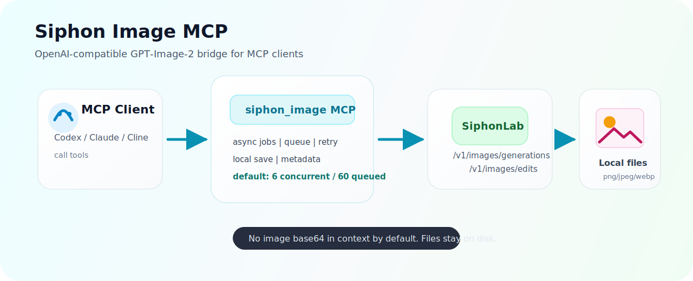
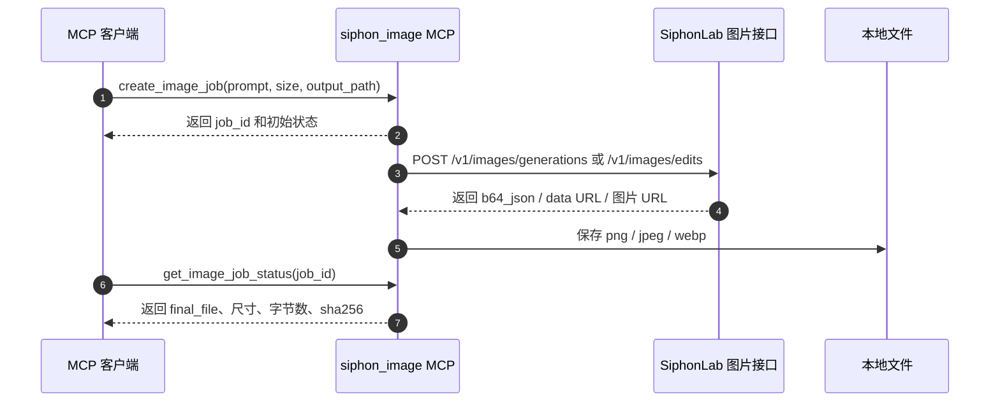

# Siphon 图片 MCP

> 面向 SiphonLab GPT-Image-2 图片接口的专业级 MCP 服务，支持文生图、图生图、局部编辑、异步任务、本地落盘和高并发队列。

[](https://nodejs.org/)
[](https://modelcontextprotocol.io/)
[](#功能能力)
[](#测试)

`siphon-image-mcp` 是一个本地 stdio MCP 服务，用于让 Codex、Claude Desktop、Cline 以及其他支持 MCP 的客户端调用 SiphonLab 提供的 OpenAI 兼容 GPT-Image-2 图片接口。

这个项目不是只用于演示的简单封装，而是按实际使用场景设计：异步任务、本地文件保存、并发队列、失败重试、任务取消、结果元数据、批量多图输出、API Key 脱敏和上下文保护都已经内置。



## 项目亮点

- **默认使用 GPT-Image-2**：默认模型为 `gpt-image-2`，也可以通过环境变量或工具参数覆盖。
- **兼容 OpenAI Images API 风格**：调用 `/v1/images/generations` 和 `/v1/images/edits`。
- **异步任务优先**：`create_image_job` 会立即返回 `job_id`，图片生成在本地 MCP 后台继续执行，避免大图生成导致客户端长时间阻塞。
- **更高本地吞吐**：默认 `6` 个并发任务、`60` 个排队任务，并且都可以通过环境变量调整。
- **支持多种结果格式**：可以处理上游返回的 `b64_json`、data URL、普通 HTTPS 图片 URL。
- **支持多图输出**：`n > 1` 时，每张图会保存为独立文件，并返回完整文件列表。
- **支持图生图和局部编辑**：输入图和 mask 支持本地路径、HTTPS URL、data URL。
- **默认不污染上下文**：下载结果默认只返回文件路径和元数据，不把大图 base64 塞回 MCP 上下文。
- **密钥不进源码**：API Key 只放在 MCP 客户端配置的环境变量中，不写入 README、源码或测试文件。

## 工作流程



## 功能能力

| 能力 | 支持情况 |
| --- | --- |
| 文生图 | 支持，走 `/v1/images/generations` |
| 图生图 / 图片编辑 | 支持，走 `/v1/images/edits` |
| 输入图片来源 | 本地路径、HTTPS URL、data URL |
| mask 来源 | 本地路径、HTTPS URL、data URL |
| 请求响应格式 | `b64_json`、`url` |
| 上游图片返回形式 | base64 JSON、data URL、HTTPS URL |
| 输出格式 | `png`、`jpeg`、`webp` |
| 异步任务 | 支持 |
| 任务取消 | 支持 best-effort 取消 |
| 幂等键 | 支持 `idempotency_key` |
| 多图输出 | 支持 `n > 1` |
| 默认并发 | `6` 个运行中任务 |
| 默认队列 | `60` 个排队任务 |

### 常用尺寸

| 名称 | 尺寸 | 比例 |
| --- | --- | --- |
| 1K 方图 | `1024x1024` | `1:1` |
| 1K 横图 | `1536x1024` | `3:2` |
| 1K 竖图 | `1024x1536` | `2:3` |
| 2K 方图 | `2048x2048` | `1:1` |
| 2K 宽屏 | `2048x1152` | `16:9` |
| 2K 竖幅 | `1152x2048` | `9:16` |
| 4K 横图 | `3840x2160` | `16:9` |
| 4K 竖图 | `2160x3840` | `9:16` |
| 自动 | `auto` | 自动 |

也支持自定义尺寸，但需要满足 GPT-Image-2 的约束：

- 最大边长：`3840px`
- 宽高都需要是 `16px` 的倍数
- 长边与短边比例不超过 `3:1`
- 总像素范围：`655,360` 到 `8,294,400`

## 安装

```bash
git clone https://github.com/2312672395/siphon-image-mcp.git
cd siphon-image-mcp
npm install
npm test
```

本地启动：

```bash
npm start
```

这个服务通过 stdio 提供 MCP 能力，日常使用时通常不需要手动运行 `npm start`，而是把它配置到 MCP 客户端里，由客户端自动拉起。

## MCP 客户端配置

### Codex Windows 配置

在 `C:\Users\<你的用户名>\.codex\config.toml` 中加入：

```toml
[mcp_servers.siphon_image]
command = 'C:\Windows\System32\cmd.exe'
args = ["/c", 'D:\Software\node\node.exe', 'D:\path\to\siphon-image-mcp\src\server.mjs']

[mcp_servers.siphon_image.env]
SIPHON_IMAGE_API_KEY = "sk-your-api-key"
SIPHON_IMAGE_BASE_URL = "https://sub.siphonlab.cn/v1"
SIPHON_IMAGE_MODEL = "gpt-image-2"
SIPHON_IMAGE_MAX_CONCURRENT = "6"
SIPHON_IMAGE_MAX_QUEUE = "60"
SIPHON_IMAGE_REQUEST_TIMEOUT_MS = "900000"
```

修改配置后，需要重启 Codex 或重新打开会话，新的 MCP 才会被加载。

### 通用 MCP JSON 配置

```json
{
  "mcpServers": {
    "siphon_image": {
      "command": "node",
      "args": ["/path/to/siphon-image-mcp/src/server.mjs"],
      "env": {
        "SIPHON_IMAGE_API_KEY": "sk-your-api-key",
        "SIPHON_IMAGE_BASE_URL": "https://sub.siphonlab.cn/v1",
        "SIPHON_IMAGE_MODEL": "gpt-image-2",
        "SIPHON_IMAGE_MAX_CONCURRENT": "6",
        "SIPHON_IMAGE_MAX_QUEUE": "60"
      }
    }
  }
}
```

## 环境变量

| 环境变量 | 默认值 | 说明 |
| --- | --- | --- |
| `SIPHON_IMAGE_API_KEY` | 必填 | SiphonLab API Key。不要提交到仓库。 |
| `SIPHON_IMAGE_BASE_URL` | `https://sub.siphonlab.cn/v1` | 图片接口地址。缺少 `/v1` 时会自动补齐。 |
| `SIPHON_IMAGE_MODEL` | `gpt-image-2` | 默认图片模型。 |
| `SIPHON_IMAGE_MAX_CONCURRENT` | `6` | 本地同时运行的最大图片任务数。 |
| `SIPHON_IMAGE_MAX_QUEUE` | `60` | 本地最大排队任务数。 |
| `SIPHON_IMAGE_REQUEST_TIMEOUT_MS` | `900000` | 单次上游请求超时时间，单位毫秒。 |
| `SIPHON_IMAGE_MAX_ATTEMPTS` | `3` | 可重试错误的最大尝试次数。 |
| `SIPHON_IMAGE_RETRY_DELAY_MS` | `800` | 重试基础等待时间，单位毫秒。 |
| `SIPHON_IMAGE_OUTPUT_DIR` | `~/.codex/generated_images/siphon_image/YYYY-MM-DD/` | 未传 `output_path` 时的默认保存目录。 |

## MCP 工具说明

### `create_image_job`

创建异步图片生成或编辑任务，并立即返回 `job_id`。

推荐日常优先使用这个工具，尤其适合高质量、大尺寸或批量图片任务。

```json
{
  "prompt": "一张玻璃香水瓶的高级产品摄影图，白色桌面，柔和棚拍灯光",
  "size": "2048x1152",
  "quality": "high",
  "output_format": "png",
  "output_path": "D:/Pictures/siphon/perfume.png",
  "idempotency_key": "perfume-hero-v1"
}
```

### `get_image_job_status`

查询本地任务状态。

```json
{
  "job_id": "img_xxxxx"
}
```

成功结果示例：

```json
{
  "ok": true,
  "job_id": "img_xxxxx",
  "status": "succeeded",
  "file": "D:/Pictures/siphon/perfume.png",
  "width": 2048,
  "height": 1152,
  "bytes": 1234567,
  "sha256": "..."
}
```

### `download_image_result`

返回已完成任务的本地文件元数据。默认不会返回图片 base64 内容。

```json
{
  "job_id": "img_xxxxx"
}
```

如果确实需要把图片内容直接放进 MCP 响应，可以显式传入：

```json
{
  "job_id": "img_xxxxx",
  "include_image": true
}
```

建议只在小图或客户端必须内联显示图片时使用 `include_image: true`。

### `cancel_image_job`

对排队中或运行中的任务执行 best-effort 取消。

```json
{
  "job_id": "img_xxxxx"
}
```

排队任务会在本地取消；运行中的任务会尝试中断本地请求，但上游如果已经开始生成，不保证一定能同步取消。

### `list_image_jobs`

列出最近的本地图片任务，可按状态过滤。

```json
{
  "status": "running",
  "limit": 20
}
```

可过滤状态：

`queued`、`running`、`succeeded`、`failed`、`canceled`、`expired`

### `get_capabilities`

返回当前 MCP 的模型、尺寸、格式、质量选项、输入字段和队列限制。

```json
{}
```

### `generate_image`

兼容旧调用习惯的别名，内部等价于创建异步任务。它也会立即返回 `job_id`，不会阻塞等待图片生成完成。

## 工具参数

| 参数 | 类型 | 是否必填 | 说明 |
| --- | --- | --- | --- |
| `prompt` | string | 是 | 图片提示词。 |
| `model` | string | 否 | 覆盖 `SIPHON_IMAGE_MODEL`。 |
| `size` | string | 否 | 例如 `1024x1024`、`2048x1152`、`3840x2160`、`auto`。 |
| `n` | number | 否 | 生成图片数量。每张图会保存成独立文件。 |
| `quality` | string | 否 | `low`、`medium`、`high`、`auto`。 |
| `format` | string | 否 | `output_format` 的别名。 |
| `output_format` | string | 否 | `png`、`jpeg`、`webp`。 |
| `response_format` | string | 否 | `b64_json` 或 `url`。 |
| `output_path` | string | 否 | 输出目录或完整文件路径。 |
| `overwrite` | boolean | 否 | 为 `false` 时，文件已存在会自动生成 `-v2`、`-v3`。 |
| `idempotency_key` | string | 否 | 同一 MCP 进程内重复提交时复用同一个本地任务。 |
| `image` / `image_path` / `input_image` | string | 否 | 单张输入图，用于图生图或图片编辑。 |
| `images` / `image_paths` / `input_images` | string[] | 否 | 多张输入图。 |
| `mask` / `mask_path` | string | 否 | 局部编辑使用的遮罩图。 |
| `background` | string | 否 | `auto` 或 `opaque`。 |
| `moderation` | string | 否 | `auto` 或 `low`。 |
| `output_compression` | integer | 否 | 上游兼容的压缩参数。 |
| `style` | string | 否 | 透传给上游的风格参数。 |
| `partial_images` | number | 否 | 透传给上游的局部图片数量参数。 |
| `stream` | boolean | 否 | 默认 `true`。 |
| `include_revised_prompt` | boolean | 否 | 兼容字段，透传给上游。 |
| `return_revised_prompt` | boolean | 否 | 兼容字段，透传给上游。 |

## 调用示例

### 1. 文生图

```json
{
  "prompt": "一张给零基础讲 DNS 的中文教学信息图，干净、明亮、适合课堂展示",
  "size": "2048x1152",
  "quality": "high",
  "output_format": "png",
  "output_path": "D:/Pictures/network-dns.png"
}
```

### 2. 一次生成多张图

```json
{
  "prompt": "为云端图片生成服务设计四个简洁图标方案，白色背景",
  "n": 4,
  "size": "1024x1024",
  "quality": "medium",
  "output_path": "D:/Pictures/icon-set.png"
}
```

会生成：

```text
icon-set-1.png
icon-set-2.png
icon-set-3.png
icon-set-4.png
```

### 3. 使用本地图片编辑

```json
{
  "prompt": "把背景换成明亮现代办公室，保持产品主体不变",
  "image_path": "D:/Pictures/product.png",
  "mask_path": "D:/Pictures/product-mask.png",
  "size": "1024x1024",
  "output_path": "D:/Pictures/product-office.png"
}
```

### 4. 使用 HTTPS 图片作为输入

```json
{
  "prompt": "把这张场景图改成精致水彩插画风格",
  "image": "https://example.com/source.png",
  "size": "1536x1024",
  "output_format": "webp"
}
```

## 输出文件规则

如果 `output_path` 是目录，MCP 会自动生成带时间戳的文件名。

如果 `output_path` 是文件且 `n > 1`，会自动追加 `-1`、`-2` 等序号。

如果目标文件已存在且 `overwrite` 不是 `true`，会自动追加 `-v2`、`-v3` 等版本号。

默认保存位置：

```text
~/.codex/generated_images/siphon_image/YYYY-MM-DD/
```

## 错误处理

错误会以结构化 JSON 返回：

```json
{
  "ok": false,
  "status": "failed",
  "error": {
    "code": "rate_limited",
    "message": "SiphonLab image API HTTP 429: ...",
    "retryable": true,
    "stage": "upstream",
    "category": "rate_limit"
  }
}
```

常见错误码：

| 错误码 | 含义 |
| --- | --- |
| `api_key_missing` | 没有配置 `SIPHON_IMAGE_API_KEY`。 |
| `invalid_size` | 图片尺寸格式错误或超出约束。 |
| `queue_full` | 本地并发和队列已满。 |
| `rate_limited` | 上游返回 HTTP 429。 |
| `network_timeout` | 请求超过 `SIPHON_IMAGE_REQUEST_TIMEOUT_MS`。 |
| `image_data_missing` | 上游响应中没有可用图片数据。 |
| `job_not_found` | 找不到指定 `job_id`。 |

以 `sk-` 开头的密钥会在序列化错误中自动脱敏。

## 测试

```bash
npm test
```

测试覆盖：

- Base URL 自动补 `/v1`
- API Key 缺失和密钥脱敏
- 文生图与编辑请求构造
- `b64_json`、data URL、HTTPS URL 三种图片结果保存
- `n > 1` 多文件输出
- 异步队列、幂等键、取消和队列限制
- 能力查询
- `list_image_jobs`

## 安全说明

- 不要提交 `.env` 文件或真实 API Key。
- API Key 应放在 MCP 客户端配置的环境变量里。
- 大图不要轻易使用 `include_image: true`，否则会把 base64 图片内容塞进 MCP 上下文。
- 如果 API Key 曾经被贴到聊天、截图、日志、Issue 或公开文档里，建议及时轮换。

## 项目结构

```text
siphon-image-mcp/
  src/server.mjs                  MCP 服务和图片任务实现
  test/siphon-image.test.mjs      Node.js 测试用例
  docs/assets/                    README 图文资源
  package.json
  README.md
```

## 开源协议

当前项目标记为 `UNLICENSED`。如果准备公开给他人复用，建议在发布前补充明确的开源协议。
