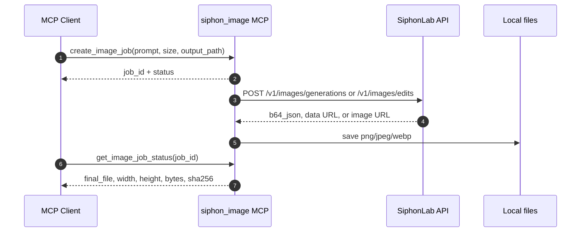

# Siphon Image MCP

> A production-ready MCP server for SiphonLab's OpenAI-compatible GPT-Image-2 image API.

[](https://nodejs.org/)
[](https://modelcontextprotocol.io/)
[](#supported-capabilities)
[](#testing)

`siphon-image-mcp` lets MCP clients such as Codex, Claude Desktop, Cline, and other stdio-compatible agents generate and edit images through SiphonLab's GPT-Image-2 compatible API.

It is designed for real work rather than quick demos: async jobs, local file persistence, queue limits, retries, cancellation, metadata-only downloads, multiple output files, and safe API-key handling are built in.


## Highlights

- **GPT-Image-2 by default**: uses `gpt-image-2` unless `SIPHON_IMAGE_MODEL` or the tool call overrides it.
- **OpenAI-compatible endpoints**: calls `/v1/images/generations` and `/v1/images/edits`.
- **Async-first job model**: `create_image_job` returns immediately with a `job_id`; large image jobs continue in the local MCP process.
- **Higher local throughput**: defaults to `6` concurrent jobs and `60` queued jobs, configurable by environment variables.
- **Multiple output formats**: saves `png`, `jpeg`, or `webp`.
- **Flexible image results**: supports upstream `b64_json`, data URL, and ordinary HTTPS image URL responses.
- **Image editing support**: accepts local files, HTTPS URLs, or data URLs as input images and masks.
- **Safe context behavior**: `download_image_result` returns metadata by default instead of pushing large image base64 into the MCP context.
- **No secret in source**: API keys belong in the MCP client environment block only.

## How It Works



## Supported Capabilities

| Capability | Supported |
| --- | --- |
| Text to image | Yes, `/v1/images/generations` |
| Image edit / image to image | Yes, `/v1/images/edits` |
| Input image sources | local path, HTTPS URL, data URL |
| Mask sources | local path, HTTPS URL, data URL |
| Response formats | `b64_json`, `url` |
| Returned image forms | base64 JSON, data URL, HTTPS URL |
| Output formats | `png`, `jpeg`, `webp` |
| Async jobs | Yes |
| Job cancellation | Best effort |
| Idempotency key | Yes |
| Multi-image output | Yes, `n > 1` |
| Default concurrency | `6` running jobs |
| Default queue length | `60` queued jobs |

### Common Sizes

| Label | Size | Aspect ratio |
| --- | --- | --- |
| 1K square | `1024x1024` | `1:1` |
| 1K landscape | `1536x1024` | `3:2` |
| 1K portrait | `1024x1536` | `2:3` |
| 2K square | `2048x2048` | `1:1` |
| 2K widescreen | `2048x1152` | `16:9` |
| 2K vertical | `1152x2048` | `9:16` |
| 4K landscape | `3840x2160` | `16:9` |
| 4K vertical | `2160x3840` | `9:16` |
| Auto | `auto` | automatic |

Custom sizes are accepted when they stay within GPT-Image-2 constraints:

- max edge: `3840px`
- edge multiple: `16px`
- max long-to-short ratio: `3:1`
- total pixels: `655,360` to `8,294,400`

## Installation

```bash
git clone https://github.com/<your-org>/siphon-image-mcp.git
cd siphon-image-mcp
npm install
npm test
```

Run locally:

```bash
npm start
```

The server speaks MCP over stdio, so normal users usually do not run it manually. Configure it in your MCP client instead.

## MCP Client Configuration

### Codex on Windows

Add a server entry to `C:\Users\<you>\.codex\config.toml`.

```toml
[mcp_servers.siphon_image]
command = 'C:\Windows\System32\cmd.exe'
args = ["/c", 'D:\Software\node\node.exe', 'D:\path\to\siphon-image-mcp\src\server.mjs']

[mcp_servers.siphon_image.env]
SIPHON_IMAGE_API_KEY = "sk-your-api-key"
SIPHON_IMAGE_BASE_URL = "https://sub.siphonlab.cn/v1"
SIPHON_IMAGE_MODEL = "gpt-image-2"
SIPHON_IMAGE_MAX_CONCURRENT = "6"
SIPHON_IMAGE_MAX_QUEUE = "60"
SIPHON_IMAGE_REQUEST_TIMEOUT_MS = "900000"
```

### Generic MCP JSON

```json
{
  "mcpServers": {
    "siphon_image": {
      "command": "node",
      "args": ["/path/to/siphon-image-mcp/src/server.mjs"],
      "env": {
        "SIPHON_IMAGE_API_KEY": "sk-your-api-key",
        "SIPHON_IMAGE_BASE_URL": "https://sub.siphonlab.cn/v1",
        "SIPHON_IMAGE_MODEL": "gpt-image-2",
        "SIPHON_IMAGE_MAX_CONCURRENT": "6",
        "SIPHON_IMAGE_MAX_QUEUE": "60"
      }
    }
  }
}
```

Restart your MCP client after changing the config.

## Environment Variables

| Variable | Default | Description |
| --- | --- | --- |
| `SIPHON_IMAGE_API_KEY` | required | SiphonLab API key. Never commit it. |
| `SIPHON_IMAGE_BASE_URL` | `https://sub.siphonlab.cn/v1` | Base URL. A missing `/v1` is appended automatically. |
| `SIPHON_IMAGE_MODEL` | `gpt-image-2` | Default image model. |
| `SIPHON_IMAGE_MAX_CONCURRENT` | `6` | Max local jobs running at the same time. |
| `SIPHON_IMAGE_MAX_QUEUE` | `60` | Max local queued jobs. |
| `SIPHON_IMAGE_REQUEST_TIMEOUT_MS` | `900000` | Per-request timeout in milliseconds. |
| `SIPHON_IMAGE_MAX_ATTEMPTS` | `3` | Max retry attempts for retryable failures. |
| `SIPHON_IMAGE_RETRY_DELAY_MS` | `800` | Base retry delay in milliseconds. |
| `SIPHON_IMAGE_OUTPUT_DIR` | `~/.codex/generated_images/siphon_image/YYYY-MM-DD/` | Default output directory. |

## Tools

### `create_image_job`

Creates an async image generation or edit job and returns a `job_id` immediately.

Use this for normal work, especially high quality or large images.

```json
{
  "prompt": "A cinematic product photo of a glass perfume bottle on a clean white table, soft studio lighting",
  "size": "2048x1152",
  "quality": "high",
  "output_format": "png",
  "output_path": "D:/Pictures/siphon/perfume.png",
  "idempotency_key": "perfume-hero-v1"
}
```

### `get_image_job_status`

Checks a local job.

```json
{
  "job_id": "img_xxxxx"
}
```

Typical successful result:

```json
{
  "ok": true,
  "job_id": "img_xxxxx",
  "status": "succeeded",
  "file": "D:/Pictures/siphon/perfume.png",
  "width": 2048,
  "height": 1152,
  "bytes": 1234567,
  "sha256": "..."
}
```

### `download_image_result`

Returns file metadata for a completed job. By default, it does **not** return base64 image content.

```json
{
  "job_id": "img_xxxxx"
}
```

To explicitly include image content in the MCP response:

```json
{
  "job_id": "img_xxxxx",
  "include_image": true
}
```

Only use `include_image: true` for small images or when the client really needs inline image data.

### `cancel_image_job`

Best-effort cancel for queued or running jobs.

```json
{
  "job_id": "img_xxxxx"
}
```

Queued jobs cancel locally. Running jobs are aborted locally, but upstream work may already have started.

### `list_image_jobs`

Lists recent local jobs.

```json
{
  "status": "running",
  "limit": 20
}
```

Supported status filters:

`queued`, `running`, `succeeded`, `failed`, `canceled`, `expired`

### `get_capabilities`

Returns model, formats, sizes, queue limits, and supported input fields.

```json
{}
```

### `generate_image`

Compatibility alias for `create_image_job`. It also creates an async job and returns `job_id`; it does not block until the image is finished.

## Tool Parameters

| Parameter | Type | Required | Description |
| --- | --- | --- | --- |
| `prompt` | string | yes | Image prompt. |
| `model` | string | no | Overrides `SIPHON_IMAGE_MODEL`. |
| `size` | string | no | `1024x1024`, `2048x1152`, `3840x2160`, `auto`, or valid custom size. |
| `n` | number | no | Number of images. Each result is saved as a separate file. |
| `quality` | string | no | `low`, `medium`, `high`, or `auto`. |
| `format` | string | no | Alias for `output_format`. |
| `output_format` | string | no | `png`, `jpeg`, or `webp`. |
| `response_format` | string | no | `b64_json` or `url`. |
| `output_path` | string | no | Directory or full file path. |
| `overwrite` | boolean | no | If `false`, existing files become `-v2`, `-v3`, etc. |
| `idempotency_key` | string | no | Reuse the same local job for duplicate submissions in the same MCP process. |
| `image`, `image_path`, `input_image` | string | no | Single input image for edit/image-to-image. |
| `images`, `image_paths`, `input_images` | string[] | no | Multiple input images. |
| `mask`, `mask_path` | string | no | Mask image for localized edits. |
| `background` | string | no | `auto` or `opaque`. |
| `moderation` | string | no | `auto` or `low`. |
| `output_compression` | integer | no | Compression option for compatible upstream responses. |
| `style` | string | no | Optional style hint forwarded to the upstream API. |
| `partial_images` | number | no | Optional upstream partial image count. |
| `stream` | boolean | no | Defaults to `true`. |
| `include_revised_prompt` | boolean | no | Forwarded compatibility field. |
| `return_revised_prompt` | boolean | no | Forwarded compatibility field. |

## Examples

### 1. Text to Image

```json
{
  "prompt": "A friendly flat illustration explaining DNS to beginners, clean Chinese classroom poster style",
  "size": "2048x1152",
  "quality": "high",
  "output_format": "png",
  "output_path": "D:/Pictures/network-dns.png"
}
```

### 2. Generate Multiple Images

```json
{
  "prompt": "Four clean icon concepts for a cloud image generation service, white background",
  "n": 4,
  "size": "1024x1024",
  "quality": "medium",
  "output_path": "D:/Pictures/icon-set.png"
}
```

This creates:

```text
icon-set-1.png
icon-set-2.png
icon-set-3.png
icon-set-4.png
```

### 3. Image Edit with Local File

```json
{
  "prompt": "Change the background to a bright modern office, keep the product unchanged",
  "image_path": "D:/Pictures/product.png",
  "mask_path": "D:/Pictures/product-mask.png",
  "size": "1024x1024",
  "output_path": "D:/Pictures/product-office.png"
}
```

### 4. Image Edit with HTTPS Input

```json
{
  "prompt": "Turn this scene into a polished watercolor illustration",
  "image": "https://example.com/source.png",
  "size": "1536x1024",
  "output_format": "webp"
}
```

## Output Files

If `output_path` is a directory, the MCP creates a timestamped filename.

If `output_path` is a file and `n > 1`, the MCP appends `-1`, `-2`, and so on.

If the target file already exists and `overwrite` is not `true`, the MCP appends `-v2`, `-v3`, and so on.

Default location:

```text
~/.codex/generated_images/siphon_image/YYYY-MM-DD/
```

## Error Handling

Errors are returned as structured JSON:

```json
{
  "ok": false,
  "status": "failed",
  "error": {
    "code": "rate_limited",
    "message": "SiphonLab image API HTTP 429: ...",
    "retryable": true,
    "stage": "upstream",
    "category": "rate_limit"
  }
}
```

Common error codes:

| Code | Meaning |
| --- | --- |
| `api_key_missing` | `SIPHON_IMAGE_API_KEY` is not configured. |
| `invalid_size` | Image size is missing, malformed, or outside constraints. |
| `queue_full` | Local concurrent + queued job limit is full. |
| `rate_limited` | Upstream returned HTTP 429. |
| `network_timeout` | Request exceeded `SIPHON_IMAGE_REQUEST_TIMEOUT_MS`. |
| `image_data_missing` | Upstream response did not include usable image data. |
| `job_not_found` | Unknown local `job_id`. |

API keys beginning with `sk-` are redacted from serialized errors.

## Testing

```bash
npm test
```

The test suite covers:

- base URL normalization
- missing key and secret redaction
- text-to-image and edit payload construction
- `b64_json`, data URL, and HTTPS URL image saving
- `n > 1` multi-file output
- async queue behavior, idempotency, cancellation, and queue limits
- capability reporting
- `list_image_jobs`

## Security Notes

- Do not commit `.env` files or real API keys.
- Put secrets in your MCP client environment config.
- Avoid `include_image: true` for large images unless the client truly needs inline base64 data.
- Rotate your API key if it was pasted into chat, screenshots, logs, issues, or public documentation.

## Project Structure

```text
siphon-image-mcp/
  src/server.mjs                  MCP server and image job implementation
  test/siphon-image.test.mjs      Node test suite
  docs/assets/                    README diagrams and assets
  package.json
  README.md
```

## License

This repository is currently marked `UNLICENSED`. Add a license before publishing it for public reuse.
